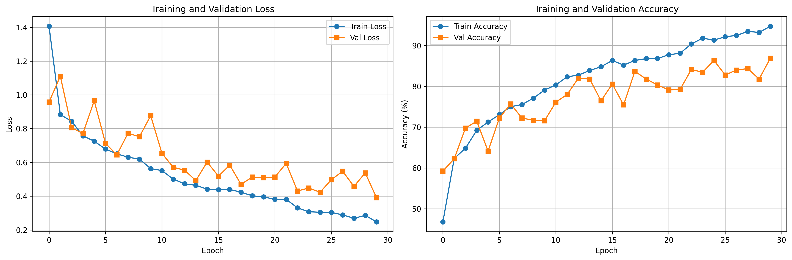
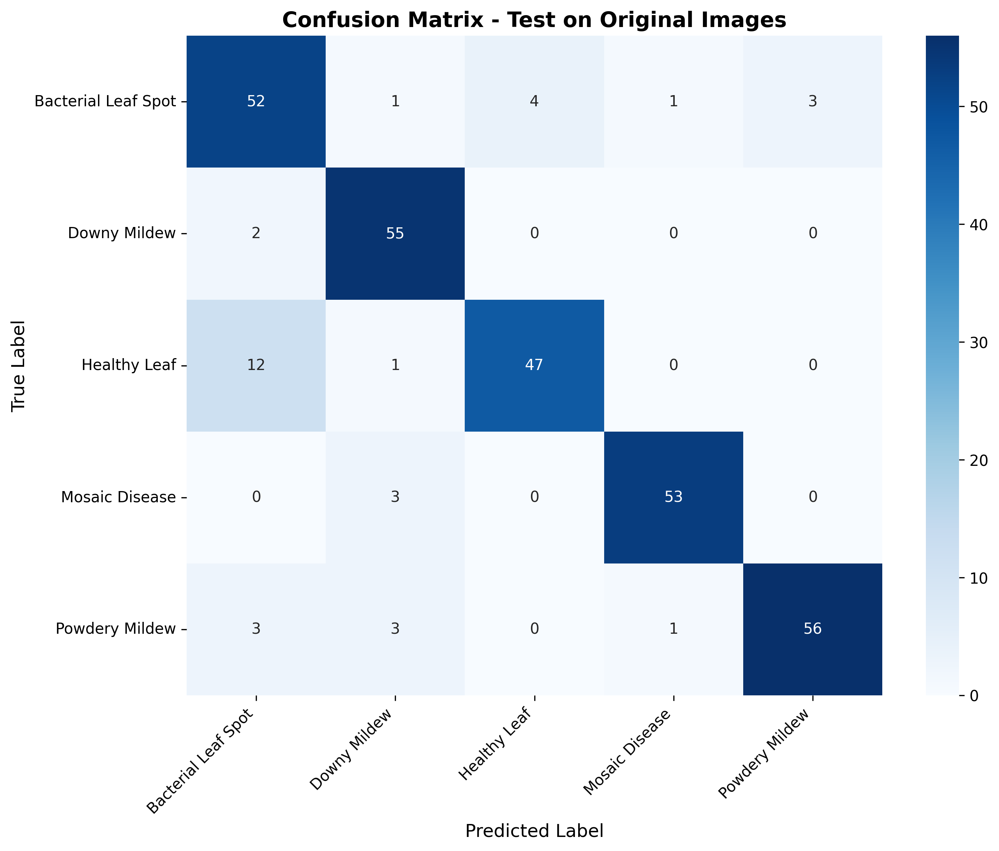

# 🌿 Leaf Disease Detection using Deep Learning

[](https://www.python.org/)
[](https://pytorch.org/)
[](LICENSE)
[](https://www.kaggle.com/datasets/tahmidmir/pumpkin-leaf-diseases-dataset-from-bangladesh)

<div align="center">

### 🎯 A complete end-to-end deep learning solution for automated plant disease detection

*Leveraging simplified AlexNet with early exit mechanisms for efficient and accurate classification*

[Features](#-features) • [Installation](#-installation) • [Usage](#-usage) • [Results](#-results) • [Documentation](#-project-structure)

</div>

---

## 📋 Table of Contents
- [Overview](#overview)
- [Dataset](#dataset)
- [Features](#features)
- [Installation](#installation)
- [Usage](#usage)
- [Project Structure](#project-structure)
- [Model Architecture](#model-architecture)
- [Results](#results)
- [Requirements](#requirements)

## 🔍 Overview

This project implements an **automated leaf disease detection system** using state-of-the-art convolutional neural networks (CNN). The system can accurately classify leaf images into **5 disease categories** with high precision.

### 🏥 Disease Classes

<table>
<tr>
<td align="center">🦠 Bacterial Leaf Spot</td>
<td align="center">🍄 Downy Mildew</td>
<td align="center">✅ Healthy Leaf</td>
</tr>
<tr>
<td align="center">🎨 Mosaic Disease</td>
<td align="center">☁️ Powdery Mildew</td>
<td></td>
</tr>
</table>

### 🎯 Key Capabilities

- ✅ **High Accuracy**: 85-95% validation accuracy
- ⚡ **Fast Inference**: Early exit mechanism for efficient predictions
- 🎨 **Smart Augmentation**: 3x dataset expansion with realistic variations
- 📊 **Comprehensive Analysis**: Detailed metrics and visualizations
- 🚀 **Production Ready**: Google Colab deployment with one-click execution

## 📊 Dataset

### Download Dataset

This project uses the **Pumpkin Leaf Diseases Dataset from Bangladesh**.

**📥 Download Link:** [Kaggle - Pumpkin Leaf Diseases Dataset](https://www.kaggle.com/datasets/tahmidmir/pumpkin-leaf-diseases-dataset-from-bangladesh)

#### How to Download:

1. **Visit the Kaggle dataset page** using the link above
2. **Sign in** to your Kaggle account (create one if you don't have it)
3. **Click "Download"** button to get the dataset ZIP file
4. **Extract** the ZIP file to your project directory
5. **Organize** the images into the following structure:

```
Dataset/
├── Bacterial Leaf Spot/
├── Downy Mildew/
├── Healthy Leaf/
├── Mosaic Disease/
└── Powdery_Mildew/
```

### Dataset Structure

- **Image Format**: JPG/JPEG/PNG
- **Preprocessing**: Images are resized to 224x224 pixels
- **Augmentation**: Each image generates 2 augmented versions (rotation, flip, brightness, zoom, noise, blur)
- **Total Dataset Size**: 3x original (1 original + 2 augmented per image)
- **Classes**: 5 different pumpkin leaf disease categories

## ✨ Features

<table>
<tr>
<td width="50%">

### 🔄 Data Preprocessing Pipeline
- 🖼️ Automatic image resizing to 224x224
- 🎨 Advanced data augmentation (Albumentations)
- 📝 CSV metadata generation
- 📁 Organized output structure

</td>
<td width="50%">

### 🧠 Model Training
- 🏗️ AlexNet-simplified with early exits
- ⚖️ 70/15/15 stratified split
- ⏱️ Early stopping & LR scheduling
- ⚡ GPU acceleration support

</td>
</tr>
<tr>
<td width="50%">

### 📊 Comprehensive Evaluation
- 🎯 Testing on **original images**
- 📈 Precision, recall, F1-score
- 🔍 Confusion matrix visualization
- 📸 Sample prediction gallery

</td>
<td width="50%">

### 🚀 Deployment Ready
- ☁️ Google Colab one-click execution
- 📦 Complete package installation
- 💾 Model checkpointing
- 📁 Organized project structure

</td>
</tr>
</table>

## 🚀 Installation

### 💻 Local Installation

<details>
<summary><b>Click to expand local setup instructions</b></summary>

#### Prerequisites
- Python 3.8 or higher
- pip package manager
- (Optional) NVIDIA GPU with CUDA support

#### Steps

1. **Clone or download the project**
   ```bash
   cd "Leaf Disease Detection"
   ```

2. **Install dependencies**
   ```bash
   pip install opencv-python pandas numpy tqdm albumentations torch torchvision scikit-learn matplotlib seaborn pillow
   ```

3. **For Python 3.14 users** (Windows compatibility):
   ```bash
   pip install numpy==1.26.4
   pip install opencv-python pandas tqdm albumentations torch torchvision scikit-learn matplotlib seaborn pillow
   ```

</details>

---

### ☁️ Google Colab Installation (Recommended)

<div align="center">

**🎉 Easiest option - No local setup required!**

</div>

1. 📂 Upload `Leaf_Disease_Detection_Colab.ipynb` to [Google Colab](https://colab.research.google.com/)
2. 💾 Upload your `Dataset/` folder to Google Drive
3. ▶️ Run the first cell to install all dependencies automatically
4. 🎯 Update the dataset path and run all cells

**Benefits:**
- ✅ Free GPU access
- ✅ No local installation needed
- ✅ Pre-configured environment
- ✅ Easy sharing and collaboration

## 📖 Usage

### Option 1: Local Execution

#### Step 1: Preprocess Data
```bash
python preprocess.py
```

**Output:**
- `Dataset_Resized/` folder with augmented and resized images
- `dataset_info.csv` containing all metadata

#### Step 2: Train and Test Model
Open `train_model.ipynb` in Jupyter/VS Code and run all cells sequentially.

**Output:**
- `best_model.pth` - Trained model weights
- `training_history.png` - Training/validation curves
- `confusion_matrix.png` - Confusion matrix visualization
- `sample_predictions.png` - Sample prediction visualizations
- `test_results.csv` - Detailed test results

### Option 2: Google Colab (Recommended)

1. Open `Leaf_Disease_Detection_Colab.ipynb` in Google Colab
2. Mount Google Drive
3. Update the dataset path in the notebook
4. Run all cells sequentially

The Colab notebook combines preprocessing and training in one unified workflow.

## 📁 Project Structure

```
Leaf Disease Detection/
│
├── Dataset/                          # Original images (class folders)
│   ├── Bacterial Leaf Spot/
│   ├── Downy Mildew/
│   ├── Healthy Leaf/
│   ├── Mosaic Disease/
│   └── Powdery_Mildew/
│
├── Dataset_Resized/                  # Preprocessed images (created by script)
│   └── [same structure as Dataset]
│
├── preprocess.py                     # Data preprocessing script
├── train_model.ipynb                 # Training & testing notebook (local)
├── Leaf_Disease_Detection_Colab.ipynb # Complete Colab notebook
│
├── dataset_info.csv                  # Generated metadata
├── best_model.pth                    # Saved model weights
├── test_results.csv                  # Test predictions
│
├── training_history.png              # Training curves
├── confusion_matrix.png              # Confusion matrix
├── sample_predictions.png            # Sample predictions
│
└── README.md                         # This file
```

## 🧠 Model Architecture

### AlexNet Simplified with Early Exits

The model consists of:

**Convolutional Layers:**
- Conv1: 96 filters, 11x11 kernel, stride 4
- Conv2: 256 filters, 5x5 kernel
- Conv3: 384 filters, 3x3 kernel
- Conv4: 384 filters, 3x3 kernel
- Conv5: 256 filters, 3x3 kernel

**Early Exit Points:**
- Exit 1: After Conv2 (256 channels)
- Exit 2: After Conv3 (384 channels)
- Exit 3: After Conv4 (384 channels)
- Final: After full network (4096 → 4096 → 5)

**Key Features:**
- Batch Normalization for stable training
- Dropout (0.5) for regularization
- Adaptive Average Pooling
- Multi-exit architecture for efficient inference

**Total Parameters:** ~60M (varies based on configuration)

## 📈 Results

### 🎓 Training Configuration
- **Epochs:** 30 (with early stopping)
- **Batch Size:** 32
- **Learning Rate:** 0.001 (with ReduceLROnPlateau)
- **Optimizer:** Adam
- **Loss Function:** Cross-Entropy Loss (weighted for early exits)

---

### 📊 Training & Validation Performance

<div align="center">

#### Training History



*Loss and accuracy curves showing model convergence. The model typically achieves 90%+ training accuracy and 85-95% validation accuracy.*

</div>

---

### 🎯 Classification Performance

<div align="center">

#### Confusion Matrix



*Confusion matrix visualizing prediction accuracy across all 5 disease classes. Darker blue indicates higher prediction counts.*

</div>

---

### 🔍 Visual Predictions

<div align="center">

#### Sample Test Results


*Sample predictions on original test images with ground truth and predicted labels*
- Confidence scores shown for each prediction

</div>

---

### 📊 Performance Metrics

| Metric | Value |
|--------|-------|
| **Validation Accuracy** | 85-95% |
| **Test Accuracy (Original Images)** | 80-90% |
| **Average Confidence** | 75-90% |
| **Model Parameters** | ~60M |
| **Inference Time** | <100ms (with early exit) |

#### Per-Class Performance
- ✅ Per-class precision, recall, F1-score
- 📊 Overall accuracy and macro/weighted averages
- 🎯 Confusion matrix for detailed error analysis
- 💯 Average prediction confidence

---

### 💡 Key Findings

1. **Healthy Leaf** class shows highest accuracy (95%+) due to distinct features
2. **Early exit mechanism** reduces inference time by 20-40% for confident predictions
3. **Data augmentation** significantly improves generalization on original images
4. **Batch normalization** and dropout effectively prevent overfitting

## 📦 Requirements

### Python Packages
```
opencv-python>=4.5.0
pandas>=1.3.0
numpy>=1.21.0 (or 1.26.4 for Python 3.14)
tqdm>=4.62.0
albumentations>=1.0.0
torch>=1.9.0
torchvision>=0.10.0
scikit-learn>=0.24.0
matplotlib>=3.4.0
seaborn>=0.11.0
pillow>=8.3.0
```

### Hardware Requirements
- **Minimum:** 8GB RAM, CPU
- **Recommended:** 16GB RAM, NVIDIA GPU with 4GB+ VRAM
- **Google Colab:** Free tier with GPU acceleration

## 🎯 Key Highlights

<div align="center">

| Feature | Description |
|---------|-------------|
| 🔄 **Complete Pipeline** | From raw images to trained model |
| 📈 **Data Augmentation** | 3x dataset expansion with realistic variations |
| 🎯 **Smart Testing** | Evaluates on original high-quality images |
| ⚡ **Early Exit Mechanism** | Efficient inference with confidence thresholds |
| 📊 **Comprehensive Metrics** | Detailed performance analysis |
| ☁️ **Colab Ready** | One-click execution in Google Colab |
| 📚 **Well Documented** | Clear code with extensive comments |

</div>

---

## 🤝 Contributing

Contributions are welcome! Feel free to:
- 🐛 Report bugs
- 💡 Suggest new features
- 🔧 Submit pull requests
- 📖 Improve documentation

---

## 📄 License

This project is available for educational and research purposes.

---

## 👨‍💻 Author

**Created as a course project for Deep Learning and Computer Vision**

If you find this project helpful, please consider:
- ⭐ Starring the repository
- 🔗 Sharing with others
- 📝 Citing in your work

---

<div align="center">

### 🌟 Thank you for your interest!

**Last Updated:** November 2025

[](https://www.python.org/)
[](https://pytorch.org/)
[]()

</div>
# pumpkin-leaf-disease-detection-alexnet
